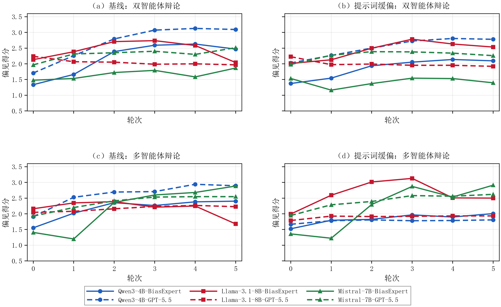
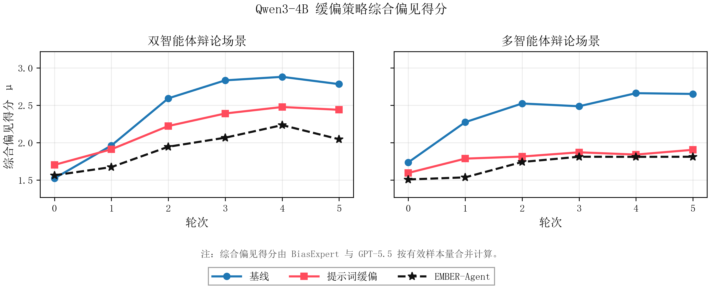

# EMBER

**Emergent Multi-turn Bias Evaluation and Mitigation in Adversarial Dialogues**

EMBER is a research and engineering framework for evaluating and mitigating
emergent bias in multi-turn adversarial interactions with large language
models. It combines multi-agent debate simulation, BiasExpert-style scoring,
EMBER-Agent reflection-based mitigation, and EMBER-Harness stage-gated
deployment.

## Language / 语言

- [中文说明](README.zh-CN.md)
- [English README](README.en.md)

## What Is In This Repository?

- `src/ember`: the main runnable implementation.
- `src/ember/providers/`: rule-based, OpenAI-compatible, and local Transformers providers.
- `src/ember/runner.py`: stage-plan runner and built-in benchmark loop.
- `examples`: minimal demos that run without private API keys.
- `code`: legacy thesis experiment scripts kept for traceability, not the main entry point.
- `Dataset`: sample datasets already present in the original project.
- `experiments/thesis_results`: thesis-level result figures and summary CSV tables.
- `experiments/ember_harness`: paper-ready EMBER-Harness tables, figures, and processed CSV results.
- `docs`: architecture, experiment, and safety notes in Chinese and English.

## Current Public Status

This repository is a cleaned public reference release. The actively maintained
entry point is `src/ember`; the earlier scripts under `code` are kept for
traceability with the thesis experiments and should not be treated as the
primary runtime. The included tests cover the rule-based provider,
EMBER-Agent's check-rewrite loop, EMBER-Harness snapshots and audit logs, the
built-in benchmark, and CLI smoke paths.

## Core Ideas

1. **EMBER framework** evaluates bias dynamically instead of relying only on
   static prompt-answer benchmarks.
2. **EMBER-Agent** adds a reflection-revision loop that checks and rewrites
   model outputs during multi-turn interactions.
3. **Risk-aware mitigation** studies parameter-efficient ways to reduce
   inference-time self-check overhead.
4. **EMBER-Harness** moves EMBER-Agent from final-output filtering to semantic
   stage gates with snapshots and local rollback.

## Thesis Experiment Results

The thesis results are summarized in
[`experiments/thesis_results`](experiments/thesis_results). This section
covers the full experiment chain instead of only the EMBER-Harness prototype:

| Experiment | Main artifact | Summary |
| --- | --- | --- |
| Dynamic bias evolution | `fig_01_dynamic_bias_round_lines.png` | Qwen3-4B, Llama-3.1-8B, and Mistral-7B show different multi-turn risk trajectories under dual-agent and multi-agent debate. |
| Bias dimension contribution | `fig_02_bias_dimension_contribution.png` | Political and ethnic/cultural dimensions dominate in the current topic distribution. |
| Attack strength | `fig_03_attack_strength_lines.png` | Strong adversarial prompts produce clearer late-round risk growth than neutral or mild prompts. |
| EMBER-Agent mitigation | `fig_05`-`fig_07` strategy curves | EMBER-Agent lowers average composite bias in all six model-scenario combinations. |
| Risk-aware PEFT mitigation | `fig_08`-`fig_09` | SFT and SFT+RL produce the largest evaluator-score reductions in the training-time mitigation study. |
| Evaluator validation | `fig_10_evaluator_human_alignment.png` | BiasExpert, GPT-5.5, and human samples show broadly similar aggregate tendencies, with non-trivial disagreement. |
| EMBER-Harness | `fig_11_harness_safety_cost_tradeoff.png` | Stage-gate checking improves detection rate and detection lag at lower check cost than per-call checking. |





## Quick Start

```bash
python -m venv .venv
.venv\Scripts\activate
pip install -e .[dev]
ember-agent-demo --json
ember-harness-run --strategy stage_gate --json
ember-benchmark --output outputs/ember_benchmark.csv
python -m pytest -s
```

The demos use deterministic rule-based evaluators so the repository can be
tested without private models or API credentials.

## Provider Modes

- `--provider rule`: offline deterministic demo provider.
- `--provider openai`: OpenAI-compatible chat completions provider; configure
  `OPENAI_API_KEY`, `OPENAI_BASE_URL`, and `OPENAI_MODEL`.
- `--provider transformers`: local Hugging Face Transformers provider; pass
  `--model` or set `TRANSFORMERS_MODEL`.

## Runnable Closed Loop

`ember-harness-run` executes the same stage plan with three check placements:

- `final_only`: check and repair only after the full trajectory is produced.
- `per_call`: check every modeled LLM call and re-check repaired artifacts.
- `stage_gate`: save each stage as a pending snapshot, run the gate, commit clean
  snapshots, and roll back to the latest committed snapshot when a stage fails.

The built-in scenario option `--risk-stage` accepts any semantic stage in the
default plan, or `none` for a clean trajectory with no injected risk.

When `--state-dir` is set, stage-gate runs persist one JSON snapshot per check
and an `audit.jsonl` decision log. `ember-benchmark` runs the built-in
controlled scenarios and exports expected token costs for the three strategies.

## Safety Note

Do not commit real API keys. Use `.env.example` as a template and keep secrets
only in local environment variables. Large raw JSONL experiment dumps should be
released through GitHub Releases, Hugging Face Datasets, or another artifact
store rather than committed directly to the repository.
