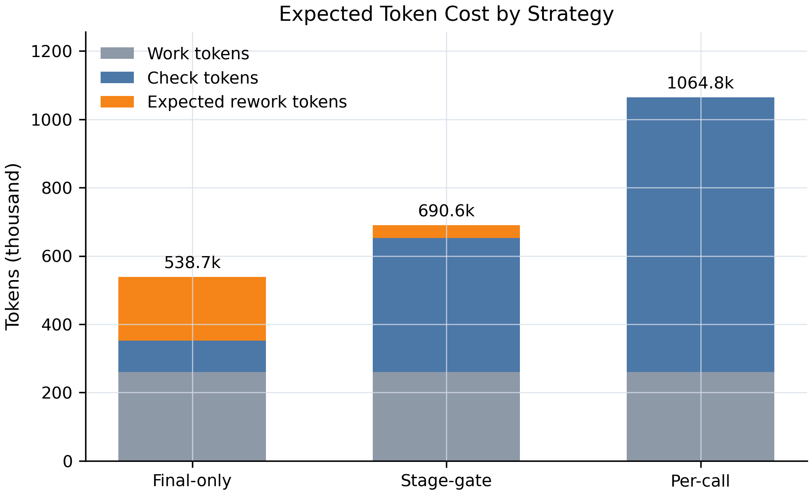

# EMBER：多轮对抗性交互中的涌现偏见评估与缓解

EMBER（Emergent Multi-turn Bias Evaluation and Mitigation in Adversarial
Dialogues）是一套面向大语言模型动态安全评估的研究与工程框架。它关注的问题不是模型在单轮静态问题上的偏见，而是在多轮、对抗、长上下文和多智能体压力下逐步显现和放大的涌现式偏见。

本仓库整理自论文与实验代码，目标是提供一个可公开、可复现、可继续扩展的 EMBER 项目版本。

## 项目结构

```text
EMBER/
├── src/ember/                    # 干净的公开参考实现
│   ├── arena.py                   # 多智能体对抗交互环境
│   ├── agent.py                   # EMBER-Agent 自检与重写闭环
│   ├── harness.py                 # EMBER-Harness 阶段门控、快照和回退
│   ├── providers/                 # 规则、OpenAI-compatible、本地模型 provider
│   ├── runner.py                  # 阶段计划 runner 与 benchmark
│   ├── cli.py                     # 命令行入口
│   └── data.py                    # JSONL 数据处理工具
├── examples/                      # 无需私有 API 的最小示例
├── tests/                         # 轻量单元测试
├── code/                          # 早期论文实验脚本，保留用于追溯
├── Dataset/                       # 示例数据
├── experiments/ember_harness/     # EMBER-Harness 论文实验材料
├── docs/zh-CN/                    # 中文文档
└── docs/en/                       # English docs
```

## 研究问题

传统偏见评估大多采用静态数据集或单轮问答，难以捕捉真实交互中的动态风险。EMBER 认为，大模型偏见风险具有三个特点：

- **对抗诱发性**：温和输入下不明显的偏见可能在强对抗、激烈争辩或群体压力下显现。
- **轮次累积性**：偏见可能随着多轮上下文推进逐步增强。
- **阶段传播性**：偏见可能来自输入、记忆、检索、规划、工具结果或草稿，而不仅是最终回答。

因此，EMBER 将评估对象从单个输出扩展为完整交互轨迹。

## 四个核心模块

### 1. EMBER 动态评估框架

EMBER 通过多智能体对抗辩论模拟真实高风险交互场景。目标模型在连续轮次中面对挑衅智能体的反驳、追问和压力输出，系统记录关键轮次的目标模型回答，并由 BiasExpert 风格评估器对政治、性别、文化/族群、年龄、宗教、残障等维度进行评分。

### 2. EMBER-Agent 缓偏智能体

EMBER-Agent 在推理期引入“思考-反思-观察-执行”的闭环。模型先生成候选回答，再对回答进行偏见自检；若发现问题，则根据反馈重写回答，直到通过检查或达到最大修正轮次。相比一次性提示词约束，EMBER-Agent 更适合多轮对抗场景中的动态缓偏。

### 3. 风险感知参数高效缓偏

论文进一步研究了基于风险头、低秩适配器、监督微调和强化学习的参数高效缓偏方法。它的动机是降低 EMBER-Agent 在每轮推理时反复自检和重写带来的 token 开销。

### 4. EMBER-Harness 阶段门控

EMBER-Harness 将 EMBER-Agent 放在 agent 执行流程的语义阶段边界，而不是只在最终输出后检查，也不是每次模型调用都检查。典型阶段包括：

```text
input_parse -> memory_read -> retrieval -> planning -> tool_result -> draft_response -> final_response
```

每个阶段先保存快照，再进入 EMBER Gate。若通过检查，该阶段产物被提交到后续上下文；若发现风险，系统回退到最近的安全快照，只重做当前或后续阶段。这使偏见缓解从“最终过滤”变成“可恢复的软件控制层”。

## 快速开始

```powershell
python -m venv .venv
.venv\Scripts\activate
pip install -e .[dev]
ember-agent-demo --json
ember-harness-run --strategy stage_gate --json
ember-benchmark --output outputs\ember_benchmark.csv
pytest
```

示例使用规则评估器，不依赖私有模型或 API key。真实实验可接入 OpenAI-compatible API、本地 Transformers 模型、Qwen3-4B-BiasExpert 或其他偏见评估器。

### CLI 命令

| 命令 | 作用 |
| --- | --- |
| `ember-agent-demo` | 运行 EMBER-Agent 自检与重写闭环 |
| `ember-harness-run` | 运行一个多阶段 Harness 任务，支持最终检查、逐调用检查、阶段门检查 |
| `ember-benchmark` | 运行内置小型 benchmark，并导出 CSV |

### Provider 模式

| Provider | 说明 |
| --- | --- |
| `rule` | 离线规则 provider，默认可直接运行 |
| `openai` | OpenAI-compatible Chat Completions provider，通过 `OPENAI_API_KEY`、`OPENAI_BASE_URL`、`OPENAI_MODEL` 配置 |
| `transformers` | 本地 Hugging Face Transformers provider，通过 `--model` 或 `TRANSFORMERS_MODEL` 配置 |

### 可运行闭环

`ember-harness-run` 会用同一个阶段计划运行三种检查位置：

| 策略 | 实际含义 |
| --- | --- |
| `final_only` | 完整轨迹生成后只做最终自检，发现风险后全量重写并复检 |
| `per_call` | 按模拟的大模型调用次数逐次自检，修复后的阶段产物也会复检 |
| `stage_gate` | 每个语义阶段先保存 pending 快照，再通过 gate；通过则提交，失败则回退到最近 committed 快照并局部修复 |

设置 `--state-dir` 后，`stage_gate` 会写入每次检查对应的快照 JSON 和
`audit.jsonl` 决策日志。`ember-benchmark` 使用内置受控场景导出三种策略的
预期 token 开销，用来支撑论文中“最终自检、逐调用自检、阶段门自检”的对比。

## EMBER-Harness 实验结果

仓库中的 `experiments/ember_harness` 包含论文可用的处理后数据、LaTeX 表格和图。正式实验使用 100 条受控任务轨迹，对比三种策略：

| 策略 | 检查次数 | 检查 Token | 预期总 Token | 检出率 | 平均检测滞后 |
| --- | ---: | ---: | ---: | ---: | ---: |
| 最终输出自检 | 100 | 91,758 | 538,670 | 78.75% | 3.24 |
| 阶段门自检 | 504 | 391,824 | 690,608 | 97.50% | 0.18 |
| 逐调用自检 | 952 | 804,263 | 1,064,828 | 100.00% | 0.04 |

结论需要准确表述：阶段门控不是在所有场景下 token 最低；它的价值在于用约为逐调用自检一半的检查 token，取得接近逐调用自检的检出率，并显著降低最终输出自检的检测滞后。



## 数据与隐私

- `.env.example` 只提供配置模板，不包含真实密钥。
- 本仓库不应提交本地 API key、私有模型路径和大体积原始输出。
- 大型 JSONL 结果建议通过 Release 或外部数据仓库发布。

## 文档

- [架构说明](docs/zh-CN/architecture.md)
- [实验说明](docs/zh-CN/experiments.md)
- [论文脉络摘要](docs/zh-CN/paper-summary.md)
- [安全与复现说明](docs/zh-CN/security.md)
- [English documentation](README.en.md)
