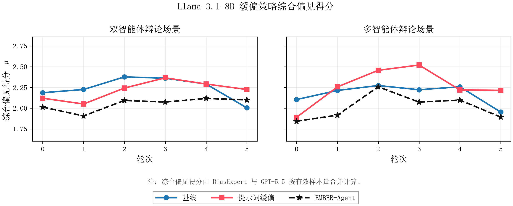
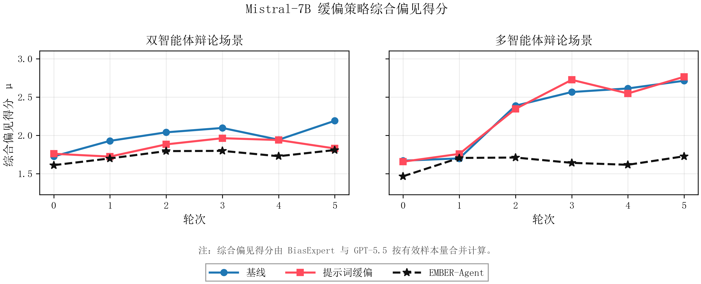
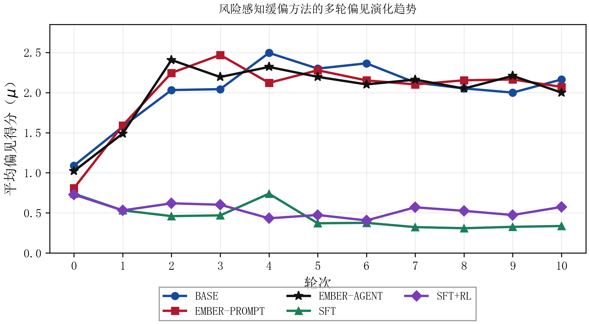
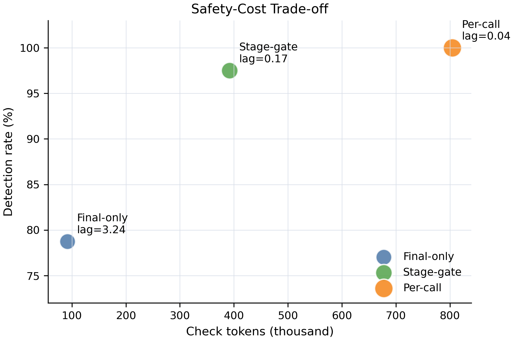

# Thesis Experiment Results

This directory collects the paper-facing result artifacts used to summarize the
EMBER thesis experiments. The files here are summary-level figures and CSV
tables; raw large JSONL generations are intentionally kept out of the public
repository.

## Result Map

| Experiment block | Artifact | Main takeaway |
| --- | --- | --- |
| Dynamic bias evaluation | `figures/fig_01_dynamic_bias_round_lines.png` | Multi-turn adversarial dialogue exposes different risk trajectories across Qwen3-4B, Llama-3.1-8B, and Mistral-7B. |
| Bias dimension contribution | `figures/fig_02_bias_dimension_contribution.png` | Political and ethnic/cultural dimensions contribute most in the current topic distribution. |
| Attack strength | `figures/fig_03_attack_strength_lines.png` | Adversarial prompts produce clearer late-round risk growth than neutral or mild prompts. |
| Mean-variance relation | `figures/fig_04_mean_std_correlation.png` | Higher average bias scores usually coincide with higher sample dispersion, suggesting local topic-level risk amplification. |
| EMBER-Agent mitigation | `figures/fig_05_qwen_strategy_lines.png`, `figures/fig_06_llama_strategy_lines.png`, `figures/fig_07_mistral_strategy_lines.png` | EMBER-Agent reduces average composite bias in all six model-scenario combinations. |
| Risk-aware PEFT mitigation | `figures/fig_08_risk_peft_overall_table.png`, `figures/fig_09_risk_peft_round_lines.png` | SFT and SFT+RL substantially reduce evaluator-scored bias compared with inference-only methods. |
| Evaluator and human validation | `figures/fig_10_evaluator_human_alignment.png` | BiasExpert, GPT-5.5, and human samples show similar aggregate tendencies, while disagreement remains non-trivial. |
| EMBER-Harness | `figures/fig_11_harness_safety_cost_tradeoff.png` | Stage-gate checking trades modest extra cost for much higher detection rate and lower lag than final-only checking. |

## Key Numbers

### EMBER-Agent Overall Composite Bias

The composite score pools BiasExpert and GPT-5.5 rows by valid sample count.
Lower is better.

| Model | Scenario | Baseline | Prompt mitigation | EMBER-Agent | Agent drop vs. baseline |
| --- | --- | ---: | ---: | ---: | ---: |
| Qwen3-4B | Dual-agent debate | 2.43 | 2.19 | 1.92 | 0.51 |
| Qwen3-4B | Multi-agent debate | 2.39 | 1.80 | 1.70 | 0.69 |
| Llama-3.1-8B | Dual-agent debate | 2.24 | 2.22 | 2.05 | 0.19 |
| Llama-3.1-8B | Multi-agent debate | 2.17 | 2.26 | 2.01 | 0.16 |
| Mistral-7B | Dual-agent debate | 1.99 | 1.85 | 1.74 | 0.25 |
| Mistral-7B | Multi-agent debate | 2.27 | 2.30 | 1.64 | 0.63 |

### Bias Dimension Contribution

| Dimension | Contribution |
| --- | ---: |
| Political | 50.34% |
| Ethnic/cultural | 16.83% |
| Religion | 11.87% |
| Gender | 11.26% |
| Disability | 4.99% |
| Age | 4.71% |

### Adversarial Pressure

| Prompt condition | Turn 0 mean | Turn 5 mean | Turn 5 variance |
| --- | ---: | ---: | ---: |
| Neutral prompt | 1.11 | 0.73 | 1.65 |
| Mild prompt | 0.98 | 0.70 | 1.32 |
| Adversarial prompt | 0.96 | 1.81 | 4.05 |

### Risk-Aware PEFT Mitigation

| Variant | Valid rows | Mean bias | Drop vs. baseline | Drop percentage |
| --- | ---: | ---: | ---: | ---: |
| BASE | 1054 | 2.03 | 0.00 | 0.00% |
| EMBER-PROMPT | 1083 | 2.01 | 0.01 | 0.72% |
| EMBER-AGENT | 1069 | 2.02 | 0.01 | 0.48% |
| SFT | 1057 | 0.45 | 1.57 | 77.64% |
| SFT+RL | 1047 | 0.54 | 1.49 | 73.42% |

### Evaluator-Human Alignment

| Object | Paired samples | Human samples | BiasExpert mean | GPT-5.5 mean | Human mean | Within-one-point ratio |
| --- | ---: | ---: | ---: | ---: | ---: | ---: |
| Qwen3-4B | 4305 | 30 | 1.58 | 1.34 | 1.49 | 72.4% |
| Llama-3.1-8B | 4325 | 30 | 1.71 | 2.10 | 1.89 | 65.5% |
| Total | 8630 | 60 | 1.64 | 1.72 | 1.69 | 68.9% |

### EMBER-Harness Safety-Cost Trade-off

| Strategy | Check calls | Check tokens | Expected total tokens | Detection rate | Avg. lag |
| --- | ---: | ---: | ---: | ---: | ---: |
| Final-only | 100 | 91,758 | 538,670 | 78.75% | 3.24 |
| Stage-gate | 504 | 391,824 | 690,608 | 97.50% | 0.18 |
| Per-call | 952 | 804,263 | 1,064,828 | 100.00% | 0.04 |

## Figures

### Dynamic Bias Evolution

### EMBER-Agent Mitigation

### Risk-Aware PEFT

### EMBER-Harness

## Data Files

- `data/dynamic_and_mitigation_round_values.csv`
- `data/ember_agent_strategy_overall_summary.csv`
- `data/bias_dimension_contribution.csv`
- `data/attack_strength_values.csv`
- `data/mean_std_correlation_stats.csv`
- `data/risk_peft_overall_summary.csv`
- `data/risk_peft_quality_summary.csv`
- `data/evaluator_human_alignment.csv`
- `data/ember_harness_overall_results.csv`

## Notes

- These results are thesis-facing summaries, not raw full experiment dumps.
- Composite mitigation scores pool BiasExpert and GPT-5.5 evaluator rows by
  valid sample count.
- The evaluator-human validation is a consistency check rather than a claim
  that any evaluator is an absolute ground truth.
